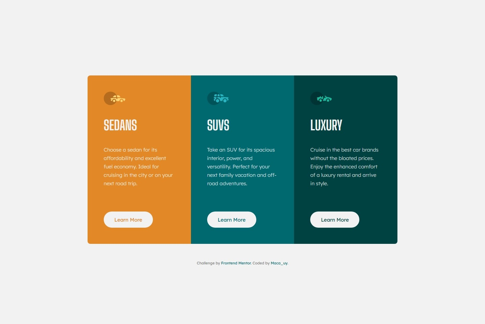

# Frontend Mentor - 3-column preview card component

This is my solution to the [3-column preview card component challenge](https://www.frontendmentor.io/challenges/3column-preview-card-component-pH92eAR2-) on Frontend Mentor. It's a great exercise to practice component-based layout, CSS architecture and responsive design.

## 📸 Preview

## 🔗 Links

- Live Site: [https://macauy.github.io/frontendmentor-3column](https://macauy.github.io/frontendmentor-3column)
- Solution Repo: [https://github.com/macauy/frontendmentor-3column](https://github.com/macauy/frontendmentor-3column)

## ⚙️ Built With

- Semantic HTML5
- CSS custom properties
- Flexbox & CSS Grid layout
- Mobile-first responsive workflow
- Basic BEM methodology
- CSS architecture (base, layout, components)

## 💡 What I Learned

- How to structure a reusable and scalable CSS architecture
- How to align buttons using `margin-top: auto` and fixed `min-height`
- How to apply BEM in a clean, consistent way
- How to ensure a pixel-perfect layout based on Figma or design screenshots
- How to improve accessibility with keyboard focus handling

## 🔭 Future Improvements

- Rebuild using Tailwind CSS for comparison
- Create a reusable card component library
- Host future projects with Vercel and automate deployments

## 🙋‍♀️ Author

- GitHub: [@macauy](https://github.com/macauy)
- Frontend Mentor: [@macauy](https://www.frontendmentor.io/profile/macauy)
- LinkedIn: [Macarena Rabosto](https://www.linkedin.com/in/macarena-rabosto/)

---

## 🙌 Acknowledgments

Thanks to [Frontend Mentor](https://www.frontendmentor.io) for providing real-world practice challenges and the community for the support.

> This project helped me solidify my frontend foundation and CSS layout strategies. I'm now more confident to tackle larger component-based projects.
